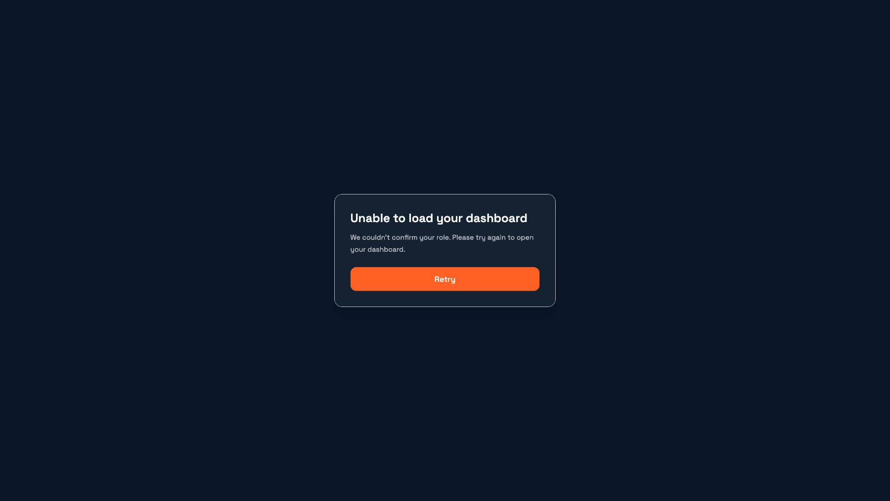
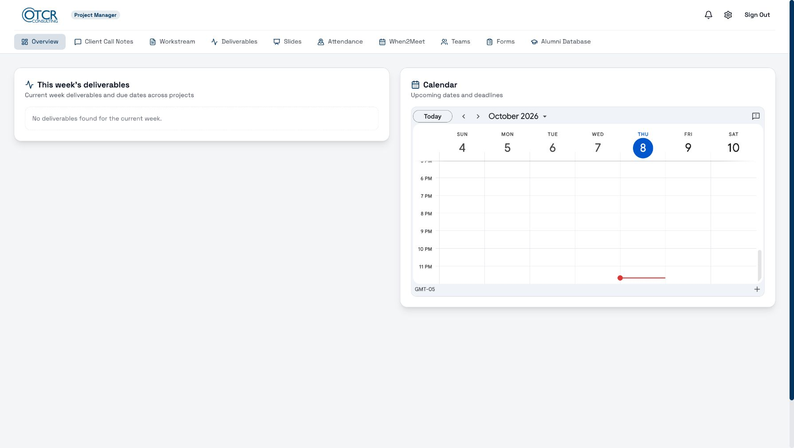

# Issue #23: role lookup recovery

The role lookup now rejects failed or invalid responses without caching a
Consultant fallback. Cache entries carry an API-source marker; older entries
are discarded because they may contain that fallback. The home page,
authenticated sign-in page, and authentication callback share an error/retry
screen. Existing callers that did not catch lookup failures use the same
recovery screen instead of leaving an unhandled rejection.

## Automated verification

From `frontend/`:

```sh
npm ci --ignore-scripts
npm run test:roles
npx tsc --noEmit
```

- All 13 role tests pass: failure followed by immediate recovery, invalid
  responses, all six valid roles, missing credentials, and a legacy fallback
  cache entry. They execute the real permissions module with synthetic API
  responses and isolated browser storage.
- The same tests against the original permissions module fail six regression
  cases, including failure/recovery and the legacy fallback cache case.
- TypeScript checking passes.
- The base branch's `npm run lint` still invokes the removed `next lint`
  command. That separate issue is tracked in #20; this PR does not modify its
  dependencies or lint configuration.

## Browser verification

Tested a local Next.js copy with the actual changed UI and permissions code,
a synthetic authenticated PM session, and a local API double. Authentication
provider replacements and the API double are verification fixtures only and
are not included in the application changes.

1. Return HTTP 503 from `/auth/role` and open `/` with no valid role cache.
   The page shows the error and Retry button, with no Consultant redirect.
2. Click Retry while the service is unavailable. The error remains usable and
   another role request is made.
3. Return `{ "role": "PM" }` and click Retry. The browser opens `/pm` and
   displays the Project Manager dashboard immediately.
4. With a fresh synthetic account and a failing role API, check `/auth/callback`
   and `/sign-in`. Both use the same recovery screen.

For manual reproduction with an authorized local development account, block
`*/auth/role` in browser developer tools, clear that account's role cache, and
repeat these steps. Restore the request before clicking Retry to verify recovery.

These checks do not validate live Microsoft sign-in or production services.
Screenshots show a synthetic account, empty CMS data, and the app's public
holiday-calendar fallback.

### Failed lookup



### Recovery


