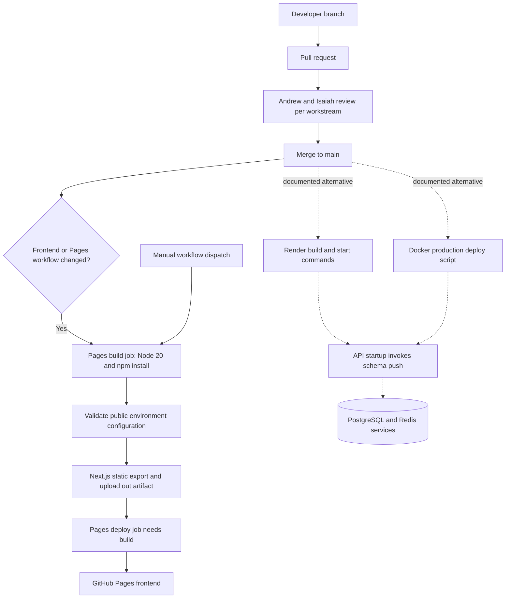
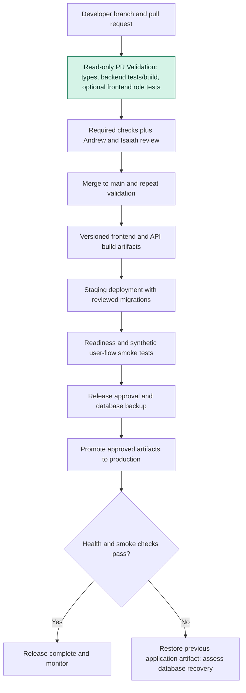

# Week 1: CMS CI/CD Pipeline Assessment

Prepared for the LC deliverables assigned to Akshay Maram and Andrew Qian. Repository assessment: October 9, 2026; finalized October 10, 2026. Evidence snapshot: main commit `14b28ee629e708f27e7030324b5ee3aa7701f3f0` (includes merged PR #34). Hosting dashboards and repository protection settings were not inspected.

## Executive assessment

The tracked pipeline builds and deploys the frontend to GitHub Pages after eligible changes reach main. It provides no pull-request validation or backend checks. Production instructions also describe Render and a separate Docker deployment script; repository files alone do not establish which route serves every production component.

The selected improvement adds read-only CI checks for both applications on pull requests and main. It catches type errors, backend test failures, and backend compilation failures before reviewers approve changes. It does not by itself enforce a merge gate or prevent the separate Pages workflow from deploying. Required checks and release gating need an explicit administrator follow-up.

## Current-state pipeline

Solid arrows describe tracked workflow behavior or the team's review process. Dotted arrows identify documented deployment alternatives whose live configuration remains unverified.

There is no tracked PR-triggered validation at this snapshot. PR #34 has introduced backend regression tests, but the existing Pages workflow does not run them. Frontend role tests are proposed in open PR #37. The Pages build validates required public configuration and produces a static artifact; its deploy job depends on that build.

## Repository evidence

All file links below are pinned to the assessed commit so reviewers can reproduce the findings.

| Evidence | What it establishes |
| --- | --- |
| [Pages workflow](https://github.com/DevOps-OTCR/otcr-dashboard/blob/14b28ee629e708f27e7030324b5ee3aa7701f3f0/.github/workflows/deploy-github-pages.yml) | Main-branch path-filtered push and manual triggers; Node 20, npm install, environment validation, static frontend build, artifact upload and deployment. No PR or backend validation. |
| [README](https://github.com/DevOps-OTCR/otcr-dashboard/blob/14b28ee629e708f27e7030324b5ee3aa7701f3f0/README.md) | Next.js frontend, NestJS API, PostgreSQL, Redis/BullMQ, Entra ID, Slack and Resend; separate Render build/start instructions. |
| [Backend package scripts](https://github.com/DevOps-OTCR/otcr-dashboard/blob/14b28ee629e708f27e7030324b5ee3aa7701f3f0/backend/package.json) | Build/test commands and startup chain through db:setup, including prisma db push --accept-data-loss. |
| [Frontend package scripts](https://github.com/DevOps-OTCR/otcr-dashboard/blob/14b28ee629e708f27e7030324b5ee3aa7701f3f0/frontend/package.json) | Frontend build/lint and explicit Prisma generation commands; no role-test script in this snapshot. |
| [Backend regression tests](https://github.com/DevOps-OTCR/otcr-dashboard/blob/14b28ee629e708f27e7030324b5ee3aa7701f3f0/backend/src/deliverables/deliverables.service.spec.ts) | Mock-based submission and notification-retry tests landed with PR #34. |
| [Production compose](https://github.com/DevOps-OTCR/otcr-dashboard/blob/14b28ee629e708f27e7030324b5ee3aa7701f3f0/docker-compose.prod.yml) and [auth controller](https://github.com/DevOps-OTCR/otcr-dashboard/blob/14b28ee629e708f27e7030324b5ee3aa7701f3f0/backend/src/auth/auth.controller.ts) | Compose calls /auth/health without authentication, while the controller is guarded. |
| [Deployment script](https://github.com/DevOps-OTCR/otcr-dashboard/blob/14b28ee629e708f27e7030324b5ee3aa7701f3f0/scripts/deploy-prod.sh) | Uses migrate dev, starts compose, waits a fixed interval and checks for an Up status rather than verifying every service and an end-to-end request. |
| [Backend Dockerfile](https://github.com/DevOps-OTCR/otcr-dashboard/blob/14b28ee629e708f27e7030324b5ee3aa7701f3f0/backend/Dockerfile.prod) and [frontend Dockerfile](https://github.com/DevOps-OTCR/otcr-dashboard/blob/14b28ee629e708f27e7030324b5ee3aa7701f3f0/frontend/Dockerfile.prod) | Node 20 container definitions and production-only dependency installation before build stages, risking missing build tooling. |

## Five prioritized gaps and recommendations

| Priority | Gap and impact | Recommended action and acceptance evidence |
| --- | --- | --- |
| 1 — Critical | API startup can push schema with an explicit data-loss option. Routine restart can alter persisted data outside a reviewed migration release. | Complete the separate migration safety work in [#24](https://github.com/DevOps-OTCR/otcr-dashboard/issues/24) / [#40](https://github.com/DevOps-OTCR/otcr-dashboard/pull/40). Baseline the existing database, test on staging, take a backup, use reviewed migrations and a controlled deploy step, and prove ordinary API startup does not mutate schema. Owner: backend maintainer and release administrator. |
| 2 — High | PRs have no tracked automated validation; backend tests now exist but are not run by the existing workflow. Failures can reach main before detection. | Add the read-only workflow in this PR, then require both checks plus review in repository rules. Include frontend production-build/lint and isolated integration smoke tests in later focused changes. Evidence: passing PR checks and a deliberately failing check preventing merge after rules are configured. Owner: LC and repository administrator. Related: [#27](https://github.com/DevOps-OTCR/otcr-dashboard/issues/27). |
| 3 — High | Health checks and deployment verification can report misleading results. The compose health URL is guarded and the shell script accepts an Up status without full-service readiness. | Resolve [#25](https://github.com/DevOps-OTCR/otcr-dashboard/issues/25), define suitable liveness/readiness probes, verify every required service, then run a synthetic authenticated smoke flow on staging. Demonstrate that an unavailable API or database fails release verification. Owner: backend and deployment maintainers. |
| 4 — Medium | Dependency/runtime choices differ across Pages, local instructions and containers. npm install can resolve drift and production-only build dependencies may omit required tooling. | Use npm ci consistently, align supported Node versions, install build dependencies in build stages and prune only for runtime, then pin the local runtime. Validate clean builds from lockfiles. This PR pins CI to Node 22 but does not change production runtimes. Owner: application maintainers. |
| 5 — Medium | Pages, Render and Docker describe different release routes without a single verified operational map. Review requirements, staging, rollback and actual host settings remain unknown. | Confirm the active hosts and auto-deploy settings, document one release owner/runbook, promote versioned artifacts after staging smoke tests, and exercise rollback. Do not infer that repository protection is absent merely because it is not in source control. Owner: LC and production administrator. |

## Proposed future-state pipeline

Only the green validation node is implemented by this PR. Merge rules, release orchestration, staging, migrations, approval and rollback are proposed follow-up work.

The future release job must depend on successful validation, rather than merely running at the same time. Database changes require a compatible forward or recovery plan; an application rollback alone cannot undo an arbitrary schema change.

## Selected PR and verification

[PR #41: Add read-only PR validation for frontend and backend](https://github.com/DevOps-OTCR/otcr-dashboard/pull/41) adds `.github/workflows/pr-validation.yml` and this assessment.

Both jobs use Node 22, npm ci --ignore-scripts, explicit Prisma generation, and TypeScript checks. Backend tests must exist and pass, followed by a Nest build. The frontend role test script runs when available after #37 merges; its absence currently provides no frontend test coverage. Lifecycle scripts are disabled during dependency installation to avoid implicit setup behavior; generation is explicit. The database URL is synthetic localhost configuration for generation, and no database service or credentials are supplied.

Validation is additive and focused: contents: read, no persisted checkout token, 15-minute timeouts and cancellation of superseded runs. It does not deploy, run startup scripts, migrate databases or change branch protection. No UI changes require screenshots.

GitHub Actions [run 38026475449](https://github.com/DevOps-OTCR/otcr-dashboard/actions/runs/38026475449) passed both jobs on workflow commit ac8e4c8: frontend installation, Prisma generation and TypeScript checking; backend installation, Prisma generation, TypeScript checking, 12 unit tests and production compilation. The optional frontend role-test script is absent on this base, so that step adds no test coverage yet. Fresh locked dependency installation also succeeded locally, but local full checks were limited by unavailable Prisma downloads and iCloud-offloaded files. The workflow was reviewed for triggers, least privilege and absence of deployment/database-write commands. Recheck the latest PR commit before merging.

Why select CI first while the schema risk ranks highest? CI is an independent, low-risk improvement that gives every reviewer feedback across both apps. Schema migration changes require a database baseline, staging and rollback review and are already tracked separately in #40. This PR partially addresses #27; it does not claim to finish its broader lint, smoke-test and developer-setup acceptance criteria.

## Brief explanation for review

Today, qualifying changes on main trigger a frontend build and Pages deployment, while backend deployment is documented separately. The largest weaknesses are unsafe startup schema changes, missing PR validation and unreliable health/release verification. The chosen PR introduces repeatable checks without touching production. Its immediate benefit is earlier failure detection; enforcement and deployment gating remain explicit follow-ups.

References: [GitHub workflow syntax](https://docs.github.com/en/actions/reference/workflows-and-actions/workflow-syntax) and [npm ci](https://docs.npmjs.com/cli/commands/npm-ci/).
